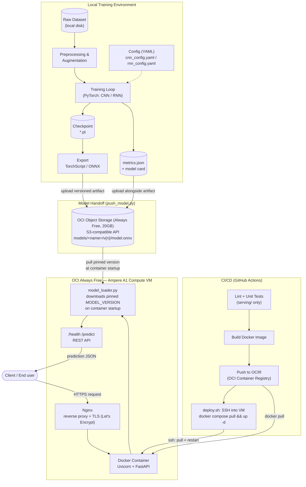

# Architecture

Stack: **PyTorch** (training) → **OCI Object Storage** (model handoff) → **FastAPI + Docker** (serving) → **OCI Always Free Compute (Ampere A1)**.

The core idea: training and serving are two independent lifecycles that only communicate
through a **versioned model artifact** sitting in object storage. The serving container
never imports training code, and the training environment never talks to the cloud
except to upload a finished model.

Deployment target is Oracle Cloud Infrastructure's **Always Free** tier specifically —
which shapes the serving side: there's no managed serverless container product in Always
Free, so the Docker container runs directly on a free Ampere A1 VM via `docker compose`,
and deploys are a CI-driven SSH pull-and-restart rather than a platform-managed rollout.

## Components

| Component | Responsibility | Lives in |
|---|---|---|
| Dataset & preprocessing | Load raw data, apply transforms/augmentation | `training/datasets/` |
| Model definitions | CNN and RNN architectures (plain `nn.Module`) | `training/models/` |
| Training loop | Train, validate, checkpoint, early-stop | `training/train.py` |
| Export | Convert checkpoint → TorchScript/ONNX, freeze for inference | `training/export.py` |
| Model push | Upload versioned artifact + metrics/model card to OCI Object Storage | `scripts/push_model.py` |
| Model loader | Download the pinned model version at container startup | `serving/app/model_loader.py` |
| Inference API | FastAPI app exposing `/health` and `/predict` | `serving/app/` |
| Containerization | Reproducible runtime for the serving app only | `serving/Dockerfile`, `serving/docker-compose.yml` |
| Deploy | SSH into the Always Free VM, pull image from OCIR, restart | `scripts/deploy.sh` |
| CI/CD | Lint, test, build image, push to OCIR, deploy on merge to `main` | `.github/workflows/ci.yml` |

## Key design decisions

- **Training and serving are decoupled.** `training/` has its own `requirements.txt`
  (heavy: torch, torchvision, matplotlib). `serving/` has a much lighter
  `requirements.txt` (fastapi, uvicorn, torch-cpu or onnxruntime) — the Docker image
  stays small and doesn't need CUDA or training-only deps.
- **Model artifacts are never committed to git.** They are large binary files that
  change every training run; git would bloat immediately. They're versioned in object
  storage instead (`models/<name>/v{n}/`), and the serving app is told which version to
  load via a `MODEL_VERSION` environment variable — this makes rollback a one-variable
  change, not a redeploy of new code.
- **Export step, not raw checkpoint, is served.** TorchScript/ONNX removes the need to
  ship model class definitions into the serving image and gives faster, dependency-light
  inference.
- **Deployed on OCI Always Free — a deliberate cost choice, not a placeholder.** Always
  Free has no time limit (unlike most clouds' 12-month trials), which fits a project
  that isn't generating revenue. The tradeoff: no managed serverless container product,
  so the Docker container runs on a real VM you administer (OS updates, Docker install,
  firewall/Security List rules), and there's no built-in autoscaling or zero-downtime
  rollout — a deploy briefly restarts the single running container.
- **Object storage still speaks S3.** `push_model.py` and `model_loader.py` use `boto3`
  against OCI Object Storage's S3-compatible endpoint rather than the OCI-specific SDK.
  This keeps the storage code ordinary and, if the project ever outgrows Always Free,
  means only the Compute/deploy side (not the storage side) would need to change.
